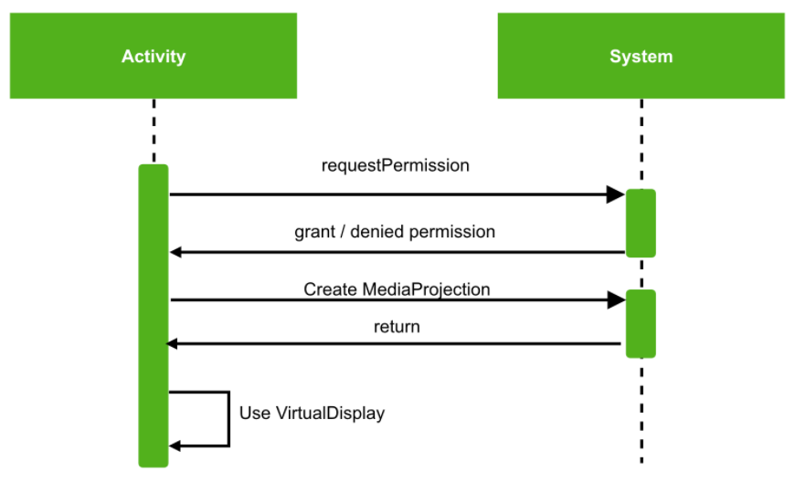

# Foreground-Service 공부

---

Supputors 프로젝트 수행에서 WebRTC를 이용한 모니터링에 Video Record 기능을 추가하기 위해 MediaProjection, VirtualDisplay, MediaProjectionManager을 사용하던 중

Oreo버전 이후에서는 Foreground Service를 사용하지 않으면 앱이 WebRTC나 VideoRecord기능을 동시에 사용하지 못하고 죽어버리는 상태가 되어 Foreground-Service를 MediaProjection에 적용시키는 법을 공부하려한다.

---

# < **MediaProjection.. >**

## MediaProjection

→ 화면을 캡쳐한 데이터를 가져오거나 음성 데이터를 가져오기 위한 API이다.

→ VirtualDisplay를 초기화하고, Stop callback을 초기화할 수 있다.

→ VirtualDisplay는 하나만 생성 가능하다.

## MediaProjection.Callback

→ 기기 전체에 VirtualDisplay를 하나만 생성할 수 있기 떄문에 MediaProjection.Callback을 등록하여 stop이벤트를 받아 녹화를 멈추도록 작업해야한다.

## MediaProjectManager

→ MediaProjectionManager은 MediaProjection을 사용하여 꼭 필요한 권한을 받기 위해 사용한다.

→ 사용자에게 권한을 받아 MediaProjection을 생성한다.

---

Android 10 부터는 foregroundService가 아니라면 아래와 같은 오류가 발생한다.

```kotlin
Caused by: java.lang.SecurityException: Media projections require a foreground service of type ServiceInfo.FOREGROUND_SERVICE_TYPE_MEDIA_PROJECTION
```

Android10 이전 버전에서는 backgroundService를 이용할 수 있었지만 

지금은 foregroundService를 이용하여 서비스를 개발하고, notification 아이콘을 노출해야한다.

**Android 10 이전 MediaProjection 동작**



Activity에서 MediaProjection의 권한을 획득하고, 그 권환을 이용하여 MediaProjection을 생성하고 처리할 수 있었다..

**Android 10 이후 MediaProjection 동작**


Activity에서는 권한을 획득하고,

Foreground Service를 이용하여 권한을 Activity에 요청하고, MediaProjection을 생성하고, 처리한다.

# Service

service를 하나 만든 후, manifests에 등록해야한다.

```xml
<service
		android:name=".ui.MediaProjectionAccessService"
		android:foregoundServiceType="mediaProjection"/>	
```

foregroundServiceType을 mediaProjection으로 지정해줘야 한다.

그리고 서비스 내부에는 startForeground()를 처리해줘야 한다.

그리고 Android O에서 NotificationChannel도 처리해줘야한다.

```kotlin
private const val FOREGROUND_SERVICE_ID = 1000

open fun startForegroundService() {
  if (Build.VERSION.SDK_INT >= Build.VERSION_CODES.O) {
          val serviceChannel = NotificationChannel(
              CHANNEL_ID,
              "Foreground Service Channel",
              NotificationManager.IMPORTANCE_DEFAULT
          )
          (getSystemService(Context.NOTIFICATION_SERVICE) as NotificationManager).apply {
              createNotificationChannel(serviceChannel)
          }
      }

    val notificationIntent = Intent(this, MediaProjectionAccessActivity::class.java)
    val pendingIntent = PendingIntent.getActivity(
        this,
        0, notificationIntent, 0
    )

    val notification = if (Build.VERSION.SDK_INT >= Build.VERSION_CODES.O) {
        Notification.Builder(this, CHANNEL_ID)
    } else {
        Notification.Builder(this)
    }
        .setContentTitle("Foreground Service")
        .setSmallIcon(R.drawable.ic_baseline_fiber_manual_record_24)
        .setContentIntent(pendingIntent)
        .build()
    startForeground(FOREGROUND_SERVICE_ID, notification)
}
```

# MediaProjection status

- OnInitialized - 서비스를 동작하고, Start 가능한 상태
- OnReject - 권한 획득을 실패한 경우
- OnStarted - 서비스를 실행하고 성공한 단계
- OnStop - 동작중 onStop callback으로 멈춘 상태
- OnFail - 그 외 Exception

이 이벤트는 LocalBroadCastReceiver을 이용하여 처리하였다.

# Permission Activity

```kotlin
startActivityForResult(
    mediaProjectionManager.createScreenCaptureIntent(),
    REQ_CODE_MEDIA_PROJECTION
)

override fun onActivityResult(requestCode: Int, resultCode: Int, data: Intent?) {
    when (requestCode) {
        REQ_CODE_MEDIA_PROJECTION -> sendBroadcast(resultCode, data)
        else -> super.onActivityResult(requestCode, resultCode, data)
    }
}
```

- startActivityForResult

    : 액티비티 전환시, 결과를 받아올 때 사용된다.

- onActivityResult

    :  A Activity에서 B Activity로 갔다가 다시 A Activity로 가고싶을 때 사용한다.

- startActivityForResult에서 mediaProjectionManager를 통해 사용자에게 권한을 요청한다.
-